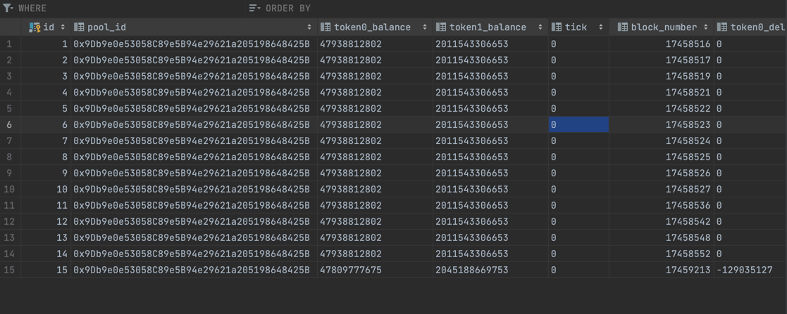

# UniSwap V3 Monitoring

This project is a monitoring service for UniSwap V3 pools that continuously tracks and logs essential data points, stores them in a persistent datastore, and provides access to the data through a REST endpoint.

## Description

The objective of this assignment is to build a monitoring service for UniSwap V3 pools using Golang. The service interacts with the blockchain using the go-ethereum package, stores data in a persistent datastore of choice, and exposes the data through a REST API.

## Functionality

- The service is configured with the addresses of the pools to track.
- Every 12 blocks, the service fetches and calculates the following data points from the configured pool contracts and saves them in the persistent datastore:

```json
{
  "token0Balance": "balance of token0 in the pool",
  "token1Balance": "balance of token1 in the pool",
  "tick": "price tick at block",
  "blockNumber": "block at which this data was read"
}
```

- The service provides the following REST endpoints to access the data:

1. Get balances at a specific block:

```json
GET /v1/api/pool/:pool_id?block={'latest','6969696'}

Response:
{
  "token0Balance": "balance of token0 in the pool at the nearest blockNumber to the given `block`",
  "token1Balance": "balance of token1 in the pool at the nearest blockNumber to the given `block`",
  "tick": "price tick nearest to the latest block"
}
```

2. Get historical balance values along with token deltas:

```json
GET /v1/api/pool/:pool_id/historic

Response:
[
  {
    "token0Balance": "balance of token0 in the pool",
    "token0Delta": "change in `token0Balance` since the previous blockNumber",
    "token1Balance": "balance of token1 in the pool",
    "token1Delta": "change in `token1Balance` since the previous blockNumber",
    "blockNumber": ""
  }
  // ...
]
```

## Installation and Usage

To run and test the application locally, follow these steps:

1. Clone the repository:

```
git clone https://github.com/YourUsername/UniSwap-V3-Monitoring.git
```

2. Install the required dependencies:

```
go mod tidy
```

3. Configure the application:

- Set the addresses of the pools to track in the configuration file.
- Configure the connection to the Ethereum client (e.g., Infura).
- Update the database connection configuration.

4. Build and run the application:

```
go run main.go
```

5. Access the REST endpoints using a tool like Postman.

- Samples from getPoolData Request
```
localhost:8081/v1/api/pool/0x9Db9e0e53058C89e5B94e29621a205198648425B?block=latest
```

And Response like that
```
  {
  "status": true,
  "message": "Success",
      "data": {
      {
            "ID": 0,
            "poolID": "0x9Db9e0e53058C89e5B94e29621a205198648425B",
            "token0Balance": "47809777675",
            "token1Balance": "2045188669753",
            "tick": "0",
            "blockNumber": 17459213,
            "token0Delta": "-129035127",
            "token1Delta": "0"
        }
      }
  }
  ```
- Samples from Get Historical Data Request
```
localhost:8081/v1/api/pool/0x9Db9e0e53058C89e5B94e29621a205198648425B/historic
```
And Response like that
```
 {
    "status": true,
    "message": "Success",
    "data": [
        {
            "ID": 1,
            "poolID": "0x9Db9e0e53058C89e5B94e29621a205198648425B",
            "token0Balance": "47938812802",
            "token1Balance": "2011543306653",
            "tick": "",
            "blockNumber": 17458517,
            "token0Delta": "0",
            "token1Delta": "0"
        },
        {
            "ID": 2,
            "poolID": "0x9Db9e0e53058C89e5B94e29621a205198648425B",
            "token0Balance": "47809777675",
            "token1Balance": "2045188669753",
            "tick": "0",
            "blockNumber": 17459213,
            "token0Delta": "-129035127",
            "token1Delta": "0"
        },
    }
  ```
- Also our Database seems like that




## Resources

- UniSwap V3 Contracts Documentation: [https://docs.uniswap.org/contracts/v3/overview](https://docs.uniswap.org/contracts/v3/overview)
- Ethereum Client (Geth): [https://geth.ethereum.org/](https://geth

.ethereum.org/)
- UniSwap V3 Pool Reference: [https://docs.uniswap.org/contracts/v3/reference/core/UniswapV3Pool](https://docs.uniswap.org/contracts/v3/reference/core/UniswapV3Pool)

Please note that this is a template for your README file. Feel free to customize it according to your project's specific details and requirements.

Let me know if you need any further assistance!
